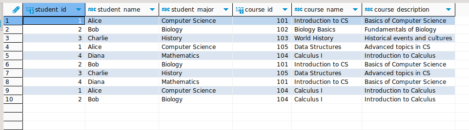

Output of Assignment:

1. Inner Join:
Question: Retrieve the list of students and their enrolled courses.

2. Left Join:
Question: List all students and their enrolled courses, including those who haven't enrolled in any course.

3. Right Join:
Question: Display all courses and the students enrolled in each course, including courses with no enrolled students.

4. Self Join:
Question: Find pairs of students who are enrolled in at least one common course.

5. Complex Join:
Question: Retrieve students who are enrolled in 'Introduction to CS' but not in 'Data Structures'.

Windows function:

1. Using ROW_NUMBER():
Question: List all students along with a row number based on their enrollment date in ascending order.

2. Using RANK():
Question: Rank students based on the number of courses they are enrolled in, handling ties by assigning the same rank.

3. Using DENSE_RANK():
Question: Determine the dense rank of courses based on their enrollment count across all students
